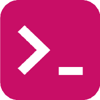

# MARKDOWN 

Markdown é uma linguagem de marcação simples originalmente criada por John Gruber e Aaron Swartz. Markdown converte seu texto em HTML válido. Markdown é frequentemente usado para formatar arquivos README, para escrever mensagens em fóruns de discussão online e para criar rich text usando um editor de texto simples.

# TÍTULOS

Podemos adicionar titulos ao markdown utilizando o simbolo #, Sendo o (#) o maior e o (#####) o menor titulo

Exemplos: 

# TITULO 1
## TITULO 2
### TITULO 3
#### TITULO 4
##### TITULO 5
###### TITULO 6

(Atalho para replicar o titulo de cima alt + shift + qualquer seta baixo ou cima)
(Atalho clicar duas vezes na palavra e na sequencia dar um ctrl + d)

# ENFASE NO TEXTO 

Negrito: usando o ** para deixar um **TEXTO** em negrito

Italico: usando o * para deixar um *TEXTO* em Italico

negrito e italico: usando o *** para deixar um ***TEXTO*** em negrito e italico

para deixar o texto riscado: usando o ~~ para deixar um ~~TEXTO~~ em para deixar o texto riscado

(para deixar em subitens basta dar um tab e colocar o -)
# Lista não ordenada 
- Matheus
- Lucas
- Thais
- Helbert
    - tomas
    - cássia

# Lista ordenada
1. Criar conta no Github
2. Instalar o Visual Studio na maquina
3. Assistir as aulas do Academy

# LINKS chaves primeiro parentese depois 
[Clique aqui](https://markdownlivepreview.com/) ou [Aqui](https://www.markdownguide.org/)

# Para imagem agora

# Tabelas

| Nome | Curso | Cidade |
-------|--------|-------
| Lucas| Full Stack | Fortaleza|
| Joao Vitor| Full Stack | Fortaleza|
| Artur | Full Stack | Fortaleza|